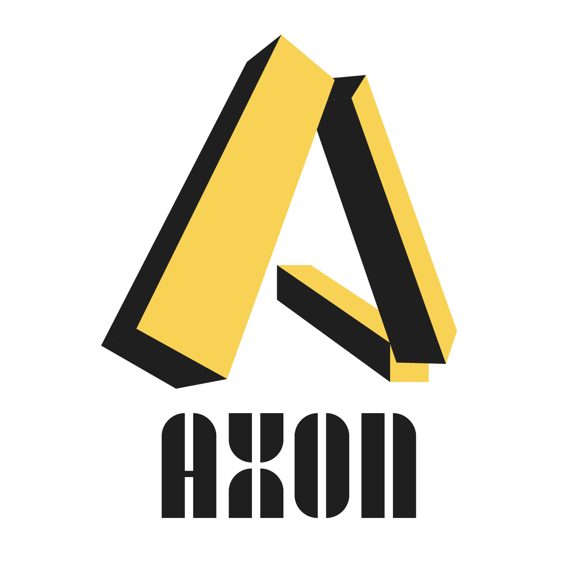

<p align="center">
  <a href="https://github.com/axonweb3/axon">
    
  </a>
  <p align="center">
	<a href="https://github.com/axonweb3/axon/releases"></a>
    <a href="https://github.com/axonweb3/axon/blob/main/LICENSE"></a>
    <a href="https://github.com/axonweb3/axon"></a>
    <a href="https://github.com/axonweb3/axon"></a>
  </p>
  <p align="center">
     Developed by AxonWeb3<br>
  </p>
</p>

> Axon is still in active development.

## What is Axon

Axon is a high-performance layer 2 framework with native cross-chain function.  Built on top of the [Overlord](https://github.com/nervosnetwork/overlord) consensus protocol and the P2P network [Tentacle](https://github.com/nervosnetwork/tentacle), Axon supports hundreds of nodes and achieves thousands of TPS. Axon is also EVM-compatible with well-developed toolchains. Its high interoperability facilitates cross-chain communication among dApps.


## Highlights

### DApps development made easy

Axon is compatible with [Ethereum](https://ethereum.org) so that all of the develop utilities can be used on it directly. And the [Axon CLI](https://github.com/axonweb3/axon-devops/axon-cli) provides an all-in-one client which includes initialization, DevOps, cross-chain request and so on. If you consider seeing is believing, there is a [15 minutes tutorial]() that will lead you to build your own chain and deploy a tiny application.

### Native cross-chain communication

Openness and mobility are the foundation of social development, so is blockchain. Cross-chain derive the taking liquidity precisely. Axon satisfy native cross-chain ability without attach to a bridge. Each of the chain based Axon can cross to [CKB](https://www.nervos.org), any other Axon based chain, and [IBC](https://ibcprotocol.org) compatible chains. Axon will embed more cross-chain protocol in future.

## Roadmap

As most of the infrastructure has been done, our next major steps will be building the following substantial features:

1. Be compatible with [IBC](https://github.com/cosmos/ibc) protocol.
2. Implement the original homologous cross-chain protocol.
3. Implement more cross-chain protocol.

## Install

The [release page](`https://github.com/axonweb3/axon/release`) provides the compiled binary. If you want to build from source code, please make sure that [rust](https://www.rust-lang.org/), [clang](http://clang.org/), [openssl](https://www.openssl.org/), [m4](https://www.gnu.org/software/m4/) have already been installed. Then execute the following command:

```bash
# Clone from GitHub
git clone https://github.com/axonweb3/axon.git && cd axon
# Run release binary
cargo run --release -- -c devtools/chain/config.toml -g devtools/chain/genesis_single_node.json
```

## Toolchain

Apart from the framework, Axon has corresponding toolchains:

- [Axon Faucet](https://github.com/axonweb3/axon-faucet): the faucet for the chain-based Axon.
- [Axon Explorer](https://github.com/Magickbase/blockscan): a blockchain explorer for the chain-based Axon.
- [Axon DevOps](https://github.com/axonweb3/axon-devops): includes several utilities, such as monitor, benchmark tool and so on.

All the toolchains above can be dictated by **[Axon CLI](https://github.com/axonweb3/axon-cli), an exquisite and deft command line interface that makes everything Axon-related easier.

## Contributing

Please read the [CONTRIBUTING.md](./CONTRIBUTING.md) for details on code of conduct, and the process for submitting pull requests to us. And the security policy is described in [SECURITY.md](./SECURITY.md).

## License

This project is licensed under the MIT License - see the [LICENSE.md](./LICENSE) file for details.

## Acknowledgment

Axon is based on [Muta](https://github.com/nervosnetwork/muta). Sincerely thanks go to everyone who [contributed code to Muta](https://github.com/nervosnetwork/muta/graphs/contributors).
