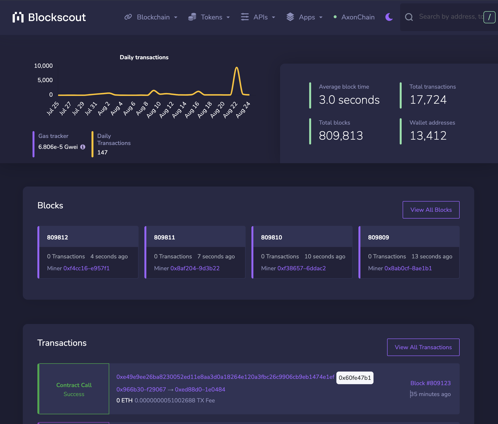

# Quick Start: Running Axon and Blockscan Locally with Docker

Run Axon and it's explorer ([blockscan](https://github.com/Magickbase/blockscan)) locally in Docker containers using [docker-compose](https://github.com/docker/compose). Please read [the `docker-compose` file](./docker-compose.yml) to learn more about the services:

- Axon node
- Blockscan as the explorer of Axon
- Postgres database

**Note**: This integration is not production ready.

## Prerequisites
Before getting started, ensure that you have the following prerequisites installed on your system:

- Docker v20.10+
- Docker-compose 2.x.x+

## Run the Services

```bash
git clone --depth=1 https://github.com/axonweb3/axon.git
cd axon/devtools/chain
docker-compose up -d


```

### Watch the logs
To monitor the logs of the running services, use the following command:
```bash
docker-compose logs -f --tail 1
```

This command will display the logs of the services, showing the latest log entries.
```js
chain-axon-1  | [2023-08-25T08:45:29.751879179+00:00 INFO overlord::state::process] Overlord: achieve consensus in height 254, costs 1 round 4.499679ms time
postgres      | 2023-08-25 08:43:02.542 UTC [28] LOG:  checkpoint complete: wrote 134 buffers (0.8%); 0 WAL file(s) added, 0 removed, 0 recycled; write=13.325 s, sync=0.003 s, total=13.336 s; sync files=34, longest=0.003 s, average=0.001 s; distance=966 kB, estimate=966 kB
blockscan     | 2023-08-25T08:45:24.008 application=indexer fetcher=empty_blocks_to_refetch [info] Start sanitizing of empty blocks. Batch size is 100
...
```

### Access the Chain
Use [Etheruem JSON-RPC API](https://ethereum.org/en/developers/docs/apis/json-rpc) to interact with the Axon node. For instance, to get the chain ID of the Axon devnet, execute the following cURL command:
```bash
# Get the chain ID of the Axon devnet
curl --location --request POST 'http://127.0.0.1:8000' \
  --header 'Content-Type: application/json' \
  --data-raw '{
    "id": 42,
    "jsonrpc": "2.0",
    "method": "eth_chainId",
    "params": []
}'

# Result: a JSON response containing the chain ID of the Axon devnet.
{"jsonrpc":"2.0","result":"0x7e6","id":42}
```

### Accessing [Blockscan](http://127.0.0.1:4020)
To access the Blockscan explorer, open your browser and visit http://127.0.0.1:4020. This will allow you to explore the Axon blockchain using the Blockscan interface.


## You are good to go!
Congratulations! 
You have successfully set up and run Axon and Blockscan locally in Docker containers. You can now start exploring the Axon blockchain and interacting with the services.

Next Steps: [Deploy and Interact with a Solidity Contract](https://docs.axonweb3.io/getting-started/for-dapp-devs/deploy_solidity)


<!--
docs: update the meaning of each transactions in Genesis.json
TODO: https://github.com/axonweb3/axon/issues/1276

# The meaning of each transactions in Genesis.json
1. `nonce = 0` means: Creation of metadata implementation contract
2. `nonce = 1` means: Creation of wckb contract
3. `nonce = 2` means: Creation of metadata proxy contract
-->
